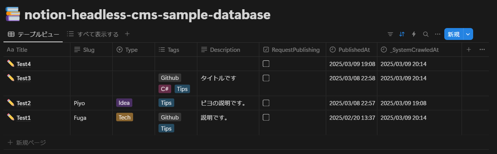
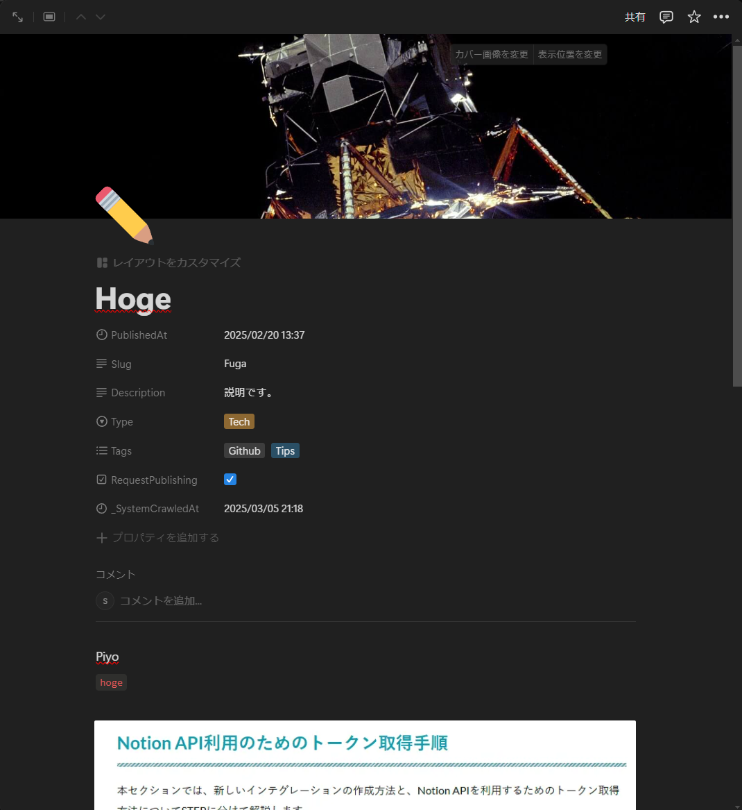
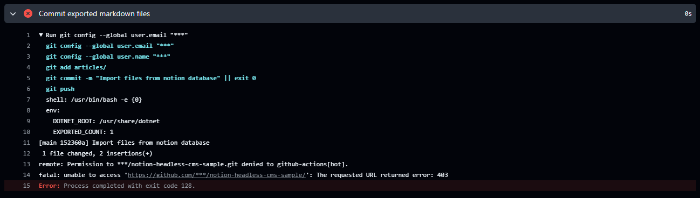
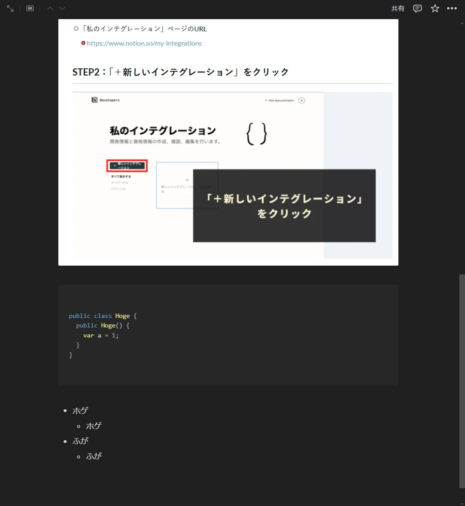
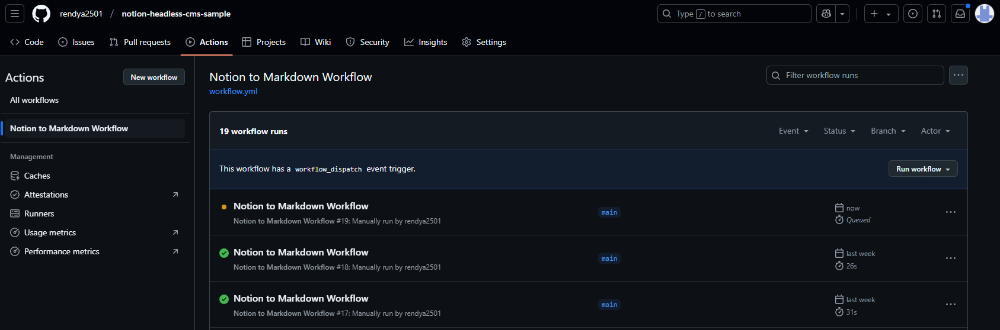
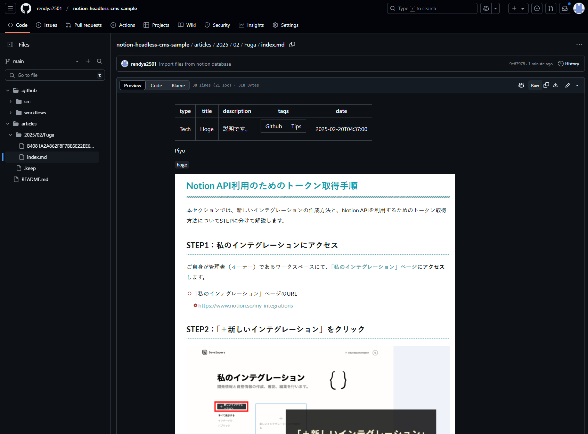

## 概要

この記事では、NotionをヘッドレスCMSとして活用し、GitHub Actionsを用いてNotionのデータをMarkdown化し、自動でGitHubに反映させる仕組みを紹介します。  

## 背景

学習記録をGitHubで管理するために、技術スタックごとにディレクトリを分けていましたが、複数技術が絡む場合の管理が煩雑でした。  
例えば、「C#でEFCoreを使ってデータベース操作をする」という記事を書いた場合、C#？ フレームワーク？ データベース？ どのディレクトリが最適なのか決めかねる、といった具合です。  
そこで、**Notionのデータベースを活用し、タグで技術スタックを管理する方法**を考えました。  

しかし、**学習記録はNotionに蓄積されるものの、GitHubには反映されない**ため、せっかくの学習成果が形として残らないのがもったいないと感じ始めました。  
「Notionに記録するだけで自動的にGitHubに同期される仕組み」があれば理想的だと考えました。  

## 理想の運用フロー

1. Notionのデータベースに学習記録を追加  
2. 記録が自動でMarkdown化され、GitHubのリポジトリにプッシュされる  

このような仕組みを実現する方法を調べたところ、GitHub Actionsを活用すれば可能であることが分かりました。  
ただし、ゼロから構築する方法を詳細に解説した記事が少なく、試行錯誤を繰り返しながらようやく実装できました。  

## **なぜこの記事を書いたのか？**

GitHub Actions の yml 設定やスクリプトを紹介する記事は多くありますが、ゼロからシステムを構築する方法を解説したものは見つかりませんでした。  
そのため、本記事では GitHub Actions の知識がほぼない状態から構築した経験をもとに、ゼロベースからの構築方法をまとめることにしました。  

## ヘッドレスCMS

このようなシステムを `ヘッドレスCMS` と言うらしいです。  
先人たちがそのように紹介していたので、自分も同じように使わせて貰います。  

参考記事:  

- [NotionヘッドレスCMS化記録 (3) GitHub Actionsと自動デプロイ | lacolaco's marginalia](https://blog.lacolaco.net/posts/notion-headless-cms-3/)  

### ヘッドレスCMSとは？

AIの回答をそのまま引用しておきます。  

>ヘッドレスCMS（Headless CMS）とは、コンテンツの管理（バックエンド）と表示（フロントエンド）を分離したコンテンツ管理システムのことです。通常のCMS（例えば WordPress など）は、管理画面でコンテンツを作成・編集し、同じシステム内でウェブサイトとして表示します。一方、ヘッドレスCMSはコンテンツ管理のみを担当し、APIを通じてデータを外部のWebサイトやアプリに提供します。
>
>「本システムでは、Notion をコンテンツ管理のバックエンドとして利用し、GitHub Actions を通じてデータを変換・反映するため、ヘッドレスCMS の概念に当てはまります。」  

だそうです。  

## 前提・環境

- OS: Windows 11 HOME 24H2  
- 言語: C#
- フレームワーク: .NET 8
- ツール: VSCode, GitHub Actions

実装言語はC#です。理由は2つあります。  

1. 自分が一番得意な言語だから  
2. この実装の核となる変換スクリプトの大本がC#で実装されていたから  
https://github.com/yucchiy/notion-to-markdown  

正直、このリポジトリが無かったら実装出来ていませんでした。  
本サンプルは、こちらのリポジトリを `.Net8`に対応させたのと細かい部分を自分なりにアレンジした物となります。  

## 実装・解説

以下の手順で実装していきます。  

1. Notionの設定  
   1. Notionデータベースを作成&プロパティの設定  
   2. NotionAPI利用のためのインテグレーショントークンの取得
   3. Notion Database ID の取得
2. GitHubリポジトリの設定
   1. リポジトリの作成とプロジェクト構成
   2. リポジトリのシークレットに登録
   3. リポジトリのpermissionsの設定
3. C#プロジェクトの作成  
4. GitHub Actionsのワークフローファイルの作成  

### 1. Notionの設定

#### 1-1. Notionデータベースを作成 & プロパティの設定

まずはNotionで記事管理用のデータベースを作成します。  

フルページでデータベースを作成してください。  
データベース名は何でも構いません。  
※自分はサンプルとして `notion-headless-cms-sample-database` としました。  

次にプロパティを設定していきます。  
以下のプロパティを追加してください。  
GitHub連携の際に必ず必要となります。  

| プロパティ | プロパティの種類 | 用途 |
|---|---|---|
| **Title** | タイトル | 記事本体のタイトル名です。ヘッダー情報に含めます。 |
| **Slug** | テキスト | GitHubで記事のディレクトリ名になります。指定しない場合はタイトルがディレクトリ名となります。 |
| **PublishedAt** | 作成日時 | 記事を作成した日時です。ヘッダー情報に含めます。 |
| **Type** | セレクト | Zennのように記事が`Idea`か`Tech`なのかを示します。ヘッダー情報に含めます。 |
| **Tags** | マルチセレクト | 技術スタック等を選択するものです。ヘッダー情報に含めます。 |
| **RequestPublishing** | チェックボックス | 記事公開フラグです。これにチェックがついている記事が公開の対象となります。 |
| **_SystemCrawledAt** | 最終更新日時 | プログラムから**RequestPublishing**フラグを操作するため、その更新日時を反映指せる為に必要となります。 |


<!--  -->

#### 1-2. NotionAPI利用のためのインテグレーショントークンの取得

こちらの記事([Notion APIのインテグレーショントークン](https://programming-zero.net/notion-api-setting/))を参考に`インテグレーショントークン`なるものを取得してください。  
`GitHub Actions` の `Seacrets` で使うのでメモしておいてください。  

#### 1-3. Notion Database ID の取得

同じくこちらの記事([【Notion】データベースIDを確認しよう｜あまてぃ](https://note.com/amatyrain/n/nb9ebe31dfab7))を参考にデータベースIDを取得してください。  

簡単なのでそのまま引用させて頂きます。  
>③URLからデータベースIDを確認
>
>URLは「`https://www.notion.so/XXXXXXXX?v=YYYYYYYY`」といった形式となっていますが、その「`XXXXXXXX`」の部分がデータベースIDとなります  

こちらも `GitHub Actions` の `Seacrets` で使うのでメモしておいてください。  

### 2. GitHubリポジトリの設定  

#### 2-1. リポジトリの作成とプロジェクト構成

新規でリポジトリを作成してください。リポジトリ名は何でも構いません。  
※自分はサンプルとして `notion-headless-cms-sample` としました。  

ここでプロジェクト構成について確認しておきます。  
今後の作業において、以下のようなプロジェクト構成でサンプルを作成していきます。  

後、このタイミングで `articles` ディレクトリを作成して `.keep` ファイルを作成しておいてください。  
`articles` ディレクトリを追跡対象とする為にダミーファイルを作成します。  
※`articles` ディレクトリが存在しないとマークダウンファイルが生成されません…

``` txt
notion-headless-cms-sample/
├── .github/
│   └── workflows/
│       └── workflow.yml        # GitHub Actionsのワークフローファイル
├── src/
│   ├── .gitignore              # ignore file
│   ├── Program.cs              # メインプログラム
│   └── NotionToMarkdown.csproj # プロジェクトファイル
└── articles/                   # 記事ディレクトリ
    ├── yyyy/
    |   ├── mm/
    |   │   ├── Hoge.md
    |   │   └── Fuga.md
    |   └── mm/
    |       └── Piyo.md
    └── .keep # articlesディレクトリを追跡対象とするためのダミーファイル
```

#### 2-2. リポジトリのシークレットに登録

こちらの記事([GitHub Actions のシークレット情報と変数の設定方法 #GitHubActions - Qiita](https://qiita.com/mkin/items/75a4928a1fafe5eacd17))を参考にしながら設定すると分かりやすいと思います。  

- `リポジトリのSettingsタブ`
- `Secrets and variablesのアコーディオン内のActions`  
- `New repository secret` ボタンを押下  

Notionの設定時にメモしておいた`インテグレーショントークン`と`Notion Database ID`を登録してください。  
`メールアドレス`と`ユーザー名`に関してはGitHub Actionsを実行した時に草を生やすために必要です。  

| 変数名 | 格納する値 |
|---|---|
| **NOTION_AUTH_TOKEN** | `1-2.` で取得した **Notion APIのインテグレーショントークン** |
| **NOTION_DATABASE_ID** | `1-3.` で取得した **Notion Database ID** |
| **USER_EMAIL** | githubに登録しているメールアドレス |
| **USER_NAME** | githubのユーザー名 |

#### 2-3. リポジトリのpermissionsの設定

次にリポジトリの`Workflow permissions`を設定していきます。  

- `リポジトリのSettingsタブ`  
- `Actionsのアコーディオン内のGeneral`  
- `Workflow permissions` のラジオボタンを確認  
- `Read and Write permissions` に変更

初期状態は `Read repository contents and packages permissions` となっていると思いますが、これを `Read and Write permissions` に変更してください。  
ここを変更しておかないと、GitHub Actionsを実行した時に`403`エラーとなってしまいます。  



- **Read and Write permissions(読み取りと書き込みの権限)**  
ワークフローには、すべてのスコープに対してリポジトリへの読み取りと書き込みの権限があります。  
- **Read repository contents and packages permissions(リポジトリのコンテンツとパッケージの読み取り権限)**  
ワークフローは、リポジトリのコンテンツとパッケージのスコープに対してのみ読み取り権限を持ちます。  

### 3. C#プロジェクトの作成  

GitHub Actionsで実行する処理を作成していきます。  
ローカルに`git clone`してVSCodeで作業するか、GitHubの`Codespaces`のどちらかで作業する事を想定しています。  
dotnetコマンドでプロジェクトを作成する方法が普通ですが、手動でファイルを作成して中身を完全にコピペする方法でも実現可能です。  

必要なのは以下の3ファイルです。  

- `NotionToMarkdown.csproj (プロジェクトファイル)`
- `Program.cs (プログラムファイル)`
- `.gitignore (ignoreファイル)`

``` txt
notion-headless-cms-sample/
├── src/
│   ├── .gitignore
│   ├── Program.cs
│   └── NotionToMarkdown.csproj
```

各ファイルの内容はサンプルリポジトリからコピペしてください。  
https://github.com/rendya2501/notion-headless-cms-sample/tree/main/src  

一応、`dotnet` コマンドでプロジェクトを作成する手順も載せておきます。  

- プロジェクトの作成  

``` bash
dotnet new console -f net8.0 -o src -n NotionToMarkdown
```

- 依存関係の追加  

``` bash
cd src
dotnet add package Notion.Net --version 4.2.0
dotnet add package Scriban --version 5.12.1
```

- ignoreファイルの作成  

``` bash
dotnet new gitignore
```

- Program.csのコピペ

:::details Program.cs

``` cs
using Notion.Client;
using System.Security.Cryptography;
using System.Text;

var notionTitlePropertyName = "Title";
var notionTypePropertyName = "Type";
var notionPublishedAtPropertyName = "PublishedAt";
var notionRequestPublisingPropertyName = "RequestPublishing";
var notionCrawledAtPropertyName = "_SystemCrawledAt";
var notionTagsPropertyName = "Tags";
var notionDescriptionPropertyName = "Description";
var notionSlugPropertyName = "Slug";

var frontMatterTitleName = "title";
var frontMatterTypeName = "type";
var frontMatterPublishedName = "date";
var frontMatterDescriptionName = "description";
var frontMatterTagsName = "tags";
var frontMatterEyecatch = "eyecatch";

if (args.Length != 3)
{
    throw new ArgumentException("args length should be three.");
}

// 引数からNotionの認証トークン、データベースID、出力ディレクトリパスのテンプレートを取得
var notionAuthToken = args[0];
var notionDatabaseId = args[1];
var outputDirectoryPathTemplate = args[2];

// Notionデータベースのフィルタを設定
var filter = new CheckboxFilter(notionRequestPublisingPropertyName, true);
// 更新フラグが立っているページを取得
var pagination = await CreateNotionClient().Databases.QueryAsync(notionDatabaseId, new DatabasesQueryParameters()
{
    Filter = filter,
});

var now = DateTime.Now;
// ページのエクスポート数
var exportedCount = 0;

// ページを取得してMarkdown形式でエクスポート
do
{
    // ページごとに処理
    foreach (var page in pagination.Results)
    {
        // ページをMarkdown形式でエクスポート
        if (!await ExportPageToMarkdownAsync(page, now))
        {
            // エクスポートに失敗した場合は次のページに進む
            continue;
        }

        // ページのプロパティを更新
        await CreateNotionClient().Pages.UpdateAsync(page.Id, new PagesUpdateParameters()
        {
            Properties = new Dictionary<string, PropertyValue>()
            {
                // 最終更新日時を更新
                [notionCrawledAtPropertyName] = new DatePropertyValue()
                {
                    Date = new Date()
                    {
                        Start = now,
                    }
                },
                // 更新フラグを下げる
                [notionRequestPublisingPropertyName] = new CheckboxPropertyValue()
                {
                    Checkbox = false,
                },
            }
        });

        exportedCount++;
    }

    // 次のページがない場合は終了
    if (!pagination.HasMore)
    {
        break;
    }

    // 次のページを取得
    pagination = await CreateNotionClient().Databases.QueryAsync(notionDatabaseId, new DatabasesQueryParameters
    {
        Filter = filter,
        StartCursor = pagination.NextCursor,
    });
} while (true);

// GITHUB_ENV環境変数のパスを取得
var githubEnvPath = Environment.GetEnvironmentVariable("GITHUB_ENV") ?? string.Empty;
// GITHUB_ENV環境変数が取得できない場合はエラーを出力
if (string.IsNullOrEmpty(githubEnvPath))
{
    throw new InvalidOperationException("The GITHUB_ENV environment variable is not set.");
}

var writeLineExportedCount = $"EXPORTED_COUNT={exportedCount}";
// GITHUB_ENVにエクスポートされたファイルの数を書き込む
using (var writer = new StreamWriter(githubEnvPath, true))
{
    writer.WriteLine(writeLineExportedCount);
}
Console.WriteLine(writeLineExportedCount);


/// <summary>
/// Notionクライアントを作成します。
/// </summary>
/// <returns>Notionクライアント</returns>
NotionClient CreateNotionClient()
{
    return NotionClientFactory.Create(new ClientOptions
    {
        AuthToken = notionAuthToken,
    });
}

/// <summary>
/// 指定されたNotionページをMarkdown形式でエクスポートします。
/// </summary>
/// <param name="page">エクスポートするNotionページ</param>
/// <param name="now">現在の日時</param>
/// <param name="forceExport">強制的にエクスポートするかどうか</param>
/// <returns>エクスポートが成功したかどうかを示すタスク</returns>
async Task<bool> ExportPageToMarkdownAsync(Page page, DateTime now, bool forceExport = false)
{
    bool requestPublishing = false;
    string title = string.Empty;
    string type = string.Empty;
    string slug = page.Id;
    string description = string.Empty;
    List<string>? tags = null;
    DateTime? publishedDateTime = null;
    DateTime? lastSystemCrawledDateTime = null;

    // frontmatterを構築
    foreach (var property in page.Properties)
    {
        if (property.Key == notionPublishedAtPropertyName)
        {
            if (TryParsePropertyValueAsDateTime(property.Value, out var parsedPublishedAt))
            {
                publishedDateTime = parsedPublishedAt;
            }
        }
        else if (property.Key == notionCrawledAtPropertyName)
        {
            if (TryParsePropertyValueAsDateTime(property.Value, out var parsedCrawledAt))
            {
                lastSystemCrawledDateTime = parsedCrawledAt;
            }
        }
        else if (property.Key == notionSlugPropertyName)
        {
            if (TryParsePropertyValueAsPlainText(property.Value, out var parsedSlug))
            {
                slug = parsedSlug;
            }
        }
        else if (property.Key == notionTitlePropertyName)
        {
            if (TryParsePropertyValueAsPlainText(property.Value, out var parsedTitle))
            {
                title = parsedTitle;
            }
        }
        else if (property.Key == notionDescriptionPropertyName)
        {
            if (TryParsePropertyValueAsPlainText(property.Value, out var parsedDescription))
            {
                description = parsedDescription;
            }
        }
        else if (property.Key == notionTagsPropertyName)
        {
            if (TryParsePropertyValueAsStringSet(property.Value, out var parsedTags))
            {
                tags = parsedTags.Select(tag => $"\"{tag}\"").ToList();
            }
        }
        else if (property.Key == notionTypePropertyName)
        {
            if (TryParsePropertyValueAsPlainText(property.Value, out var parsedType))
            {
                type = parsedType;
            }
        }
        else if (property.Key == notionRequestPublisingPropertyName)
        {
            if (TryParsePropertyValueAsBoolean(property.Value, out var parsedBoolean))
            {
                requestPublishing = parsedBoolean;
            }
        }
    }

    if (!requestPublishing)
    {
        Console.WriteLine($"{page.Id}(title = {title}): No request publishing.");
        return false;
    }

    if (!publishedDateTime.HasValue)
    {
        Console.WriteLine($"{page.Id}(title = {title}): Skip updating becase this page don't have publish ate.");
        return false;
    }

    if (!forceExport)
    {
        if (now < publishedDateTime.Value)
        {
            Console.WriteLine($"{page.Id}(title = {title}): Skip updating because the publication date have not been reached");
            return false;
        }
    }

    slug = string.IsNullOrEmpty(slug) ? title : slug;
    var outputDirectory = BuildOutputDirectory(publishedDateTime.Value, title, slug);
    if (!Directory.Exists(outputDirectory))
    {
        Directory.CreateDirectory(outputDirectory);
    }

    var stringBuilder = new StringBuilder();
    stringBuilder.AppendLine("---");

    if (!string.IsNullOrWhiteSpace(type))
    {
        stringBuilder.AppendLine($"{frontMatterTypeName}: \"{type}\"");
    }

    stringBuilder.AppendLine($"{frontMatterTitleName}: \"{title}\"");

    if (!string.IsNullOrWhiteSpace(description))
    {
        stringBuilder.AppendLine($"{frontMatterDescriptionName}: \"{description}\"");
    }
    if (tags is not null)
    {
        stringBuilder.AppendLine($"{frontMatterTagsName}: [{string.Join(',', tags)}]");
    }
    stringBuilder.AppendLine($"{frontMatterPublishedName}: \"{publishedDateTime.Value.ToString("s")}\"");

    if (page.Cover is not null && page.Cover is UploadedFile uploadedFile)
    {
        var (fileName, _) = await DownloadImage(uploadedFile.File.Url, outputDirectory);
        stringBuilder.AppendLine($"{frontMatterEyecatch}: \"./{fileName}\"");
    }

    stringBuilder.AppendLine("");
    stringBuilder.AppendLine("---");
    stringBuilder.AppendLine("");


    // ページの内容を追加
    var pagination = await CreateNotionClient().Blocks.RetrieveChildrenAsync(page.Id);
    do
    {
        foreach (Block block in pagination.Results.Cast<Block>())
        {
            await AppendBlockLineAsync(block, string.Empty, outputDirectory, stringBuilder);
        }

        if (!pagination.HasMore)
        {
            break;
        }

        pagination = await CreateNotionClient().Blocks.RetrieveChildrenAsync(page.Id, new BlocksRetrieveChildrenParameters
        {
            StartCursor = pagination.NextCursor,
        });
    } while (true);

    using var fileStream = File.OpenWrite($"{outputDirectory}/index.md");
    using var streamWriter = new StreamWriter(fileStream, new UTF8Encoding(false));
    await streamWriter.WriteAsync(stringBuilder.ToString());

    return true;
}

/// <summary>
/// 出力ディレクトリを構築します。
/// </summary>
/// <param name="publishedDate">公開日</param>
/// <param name="title">タイトル</param>
/// <param name="slug">スラッグ</param>
/// <returns>出力ディレクトリのパス</returns>
string BuildOutputDirectory(DateTime publishedDate, string title, string slug)
{
    var template = Scriban.Template.Parse(outputDirectoryPathTemplate);
    return template.Render(new
    {
        publish = publishedDate,
        title = title,
        slug = slug,
    });
}

/// <summary>
/// プロパティ値をDateTimeとして解析します。
/// </summary>
/// <param name="value">プロパティ値</param>
/// <param name="dateTime">解析されたDateTime</param>
/// <returns>解析が成功したかどうか</returns>
bool TryParsePropertyValueAsDateTime(PropertyValue value, out DateTime dateTime)
{
    dateTime = default;
    switch (value)
    {
        case DatePropertyValue dateProperty:
            if (dateProperty.Date == null) return false;
            if (!dateProperty.Date.Start.HasValue) return false;

            dateTime = dateProperty.Date.Start.Value;

            break;
        case CreatedTimePropertyValue createdTimeProperty:
            if (!DateTime.TryParse(createdTimeProperty.CreatedTime, out dateTime))
            {
                return false;
            }

            break;
        case LastEditedTimePropertyValue lastEditedTimeProperty:
            if (!DateTime.TryParse(lastEditedTimeProperty.LastEditedTime, out dateTime))
            {
                return false;
            }

            break;

        default:
            if (!TryParsePropertyValueAsPlainText(value, out var plainText))
            {
                return false;
            }

            if (!DateTime.TryParse(plainText, out dateTime))
            {
                return false;
            }

            break;
    }

    return true;
}


/// <summary>
/// プロパティ値をプレーンテキストとして解析します。
/// </summary>
/// <param name="value">プロパティ値</param>
/// <param name="text">解析されたテキスト</param>
/// <returns>解析が成功したかどうか</returns>
bool TryParsePropertyValueAsPlainText(PropertyValue value, out string text)
{
    text = string.Empty;
    switch (value)
    {
        case RichTextPropertyValue richTextProperty:
            foreach (var richText in richTextProperty.RichText)
            {
                text += richText.PlainText;
            }
            break;
        case TitlePropertyValue titleProperty:
            foreach (var richText in titleProperty.Title)
            {
                text += richText.PlainText;
            }
            break;
        case SelectPropertyValue selectPropertyValue:
            text = selectPropertyValue.Select?.Name ?? "";
            break;
        default:
            return false;
    }

    return true;
}


/// <summary>
/// プロパティ値を文字列セットとして解析します。
/// </summary>
/// <param name="value">プロパティ値</param>
/// <param name="set">解析された文字列セット</param>
/// <returns>解析が成功したかどうか</returns>
bool TryParsePropertyValueAsStringSet(PropertyValue value, out List<string> set)
{
    //set = new List<string>();
    set = [];
    switch (value)
    {
        case MultiSelectPropertyValue multiSelectProperty:
            foreach (var selectValue in multiSelectProperty.MultiSelect)
            {
                set.Add(selectValue.Name);
            }
            break;
        default:
            return false;
    }

    return true;
}


/// <summary>
/// プロパティ値をブール値として解析します。
/// </summary>
/// <param name="value">プロパティ値</param>
/// <param name="boolean">解析されたブール値</param>
/// <returns>解析が成功したかどうか</returns>
bool TryParsePropertyValueAsBoolean(PropertyValue value, out bool boolean)
{
    boolean = false;
    switch (value)
    {
        case CheckboxPropertyValue checkboxProperty:
            boolean = checkboxProperty.Checkbox;
            break;
        default:
            return false;
    }

    return true;
}


/// <summary>
/// ブロック行を追加します。
/// </summary>
/// <param name="block">ブロック</param>
/// <param name="indent">インデント</param>
/// <param name="outputDirectory">出力ディレクトリ</param>
/// <param name="stringBuilder">StringBuilder</param>
/// <returns>タスク</returns>
async Task AppendBlockLineAsync(Block block, string indent, string outputDirectory, StringBuilder stringBuilder)
{
    switch (block)
    {
        case ParagraphBlock paragraphBlock:
            foreach (var text in paragraphBlock.Paragraph.RichText)
            {
                AppendRichText(text, stringBuilder);
            }
            stringBuilder.AppendLine(string.Empty);
            break;
        case HeadingOneBlock h1:
            stringBuilder.Append($"{indent}# ");
            foreach (var text in h1.Heading_1.RichText)
            {
                AppendRichText(text, stringBuilder);
            }
            stringBuilder.AppendLine(string.Empty);
            break;
        case HeadingTwoBlock h2:
            stringBuilder.Append($"{indent}## ");
            foreach (var text in h2.Heading_2.RichText)
            {
                AppendRichText(text, stringBuilder);
            }
            stringBuilder.AppendLine(string.Empty);
            break;
        case HeadingThreeBlock h3:
            stringBuilder.Append($"{indent}### ");
            foreach (var text in h3.Heading_3.RichText)
            {
                AppendRichText(text, stringBuilder);
            }
            stringBuilder.AppendLine(string.Empty);
            break;
        case ImageBlock imageBlock:
            await AppendImageAsync(imageBlock, indent, outputDirectory, stringBuilder);
            stringBuilder.AppendLine(string.Empty);
            break;
        case CodeBlock codeBlock:
            AppendCode(codeBlock, indent, stringBuilder);
            stringBuilder.AppendLine(string.Empty);
            break;
        case BulletedListItemBlock bulletListItemBlock:
            AppendBulletListItem(bulletListItemBlock, indent, stringBuilder);
            break;
        case NumberedListItemBlock numberedListItemBlock:
            AppendNumberedListItem(numberedListItemBlock, indent, stringBuilder);
            break;
        case BookmarkBlock bookmarkBlock:
            var caption = bookmarkBlock.Bookmark.Caption.FirstOrDefault()?.PlainText;
            var url = bookmarkBlock.Bookmark.Url;
            if (!string.IsNullOrEmpty(caption))
            {
                stringBuilder.Append($"[{caption}]({url})");
                break;
            }
            stringBuilder.Append($"<{url}>");
            break;
        case DividerBlock divider:
            stringBuilder.Append("---");
            break;
    }

    stringBuilder.AppendLine(string.Empty);

    if (block.HasChildren)
    {
        var pagination = await CreateNotionClient().Blocks.RetrieveChildrenAsync(block.Id);
        do
        {
            foreach (Block childBlock in pagination.Results.Cast<Block>())
            {
                await AppendBlockLineAsync(childBlock, $"    {indent}", outputDirectory, stringBuilder);
            }

            if (!pagination.HasMore)
            {
                break;
            }

            pagination = await CreateNotionClient().Blocks.RetrieveChildrenAsync(block.Id, new BlocksRetrieveChildrenParameters
            {
                StartCursor = pagination.NextCursor,
            });
        } while (true);
    }
}


/// <summary>
/// リッチテキストを追加します。
/// </summary>
/// <param name="richText">リッチテキスト</param>
/// <param name="stringBuilder">StringBuilder</param>
void AppendRichText(RichTextBase richText, StringBuilder stringBuilder)
{
    var text = richText.PlainText;

    if (!string.IsNullOrEmpty(richText.Href))
    {
        text = $"[{text}]({richText.Href})";
    }

    if (richText.Annotations.IsCode)
    {
        text = $"`{text}`";
    }

    if (richText.Annotations.IsItalic && richText.Annotations.IsBold)
    {
        text = $"***{text}***";
    }
    else if (richText.Annotations.IsBold)
    {
        text = $"**{text}**";
    }
    else if (richText.Annotations.IsItalic)
    {
        text = $"*{text}*";
    }

    if (richText.Annotations.IsStrikeThrough)
    {
        text = $"~{text}~";
    }

    stringBuilder.Append(text);
}


/// <summary>
/// 画像を追加します。
/// </summary>
/// <param name="imageBlock">画像ブロック</param>
/// <param name="indent">インデント</param>
/// <param name="outputDirectory">出力ディレクトリ</param>
/// <param name="stringBuilder">StringBuilder</param>
/// <returns>タスク</returns>
async Task AppendImageAsync(ImageBlock imageBlock, string indent, string outputDirectory, StringBuilder stringBuilder)
{
    var url = string.Empty;
    switch (imageBlock.Image)
    {
        case ExternalFile externalFile:
            url = externalFile.External.Url;
            break;
        case UploadedFile uploadedFile:
            url = uploadedFile.File.Url;
            break;
    }

    if (!string.IsNullOrEmpty(url))
    {
        var (fileName, _) = await DownloadImage(url, outputDirectory);
        stringBuilder.Append($"{indent}");
    }
}


/// <summary>
/// 画像をダウンロードします。
/// </summary>
/// <param name="url">画像のURL</param>
/// <param name="outputDirectory">出力ディレクトリ</param>
/// <returns>ファイル名とファイルパスのタプル</returns>
async Task<(string, string)> DownloadImage(string url, string outputDirectory)
{
    var uri = new Uri(url);
    var input = Encoding.UTF8.GetBytes(uri.LocalPath);
    var fileName = $"{Convert.ToHexString(MD5.HashData(input))}{Path.GetExtension(uri.LocalPath)}";
    var filePath = $"{outputDirectory}/{fileName}";

    using var client = new HttpClient();
    var response = await client.GetAsync(uri);
    response.EnsureSuccessStatusCode();
    await using var fs = new FileStream(filePath, FileMode.Create, FileAccess.Write, FileShare.None);
    await response.Content.CopyToAsync(fs);

    return (fileName, filePath);
}


/// <summary>
/// コードブロックを追加します。
/// </summary>
/// <param name="codeBlock">コードブロック</param>
/// <param name="indent">インデント</param>
/// <param name="stringBuilder">StringBuilder</param>
void AppendCode(CodeBlock codeBlock, string indent, StringBuilder stringBuilder)
{
    stringBuilder.AppendLine($"{indent}```{NotionCodeLanguageToMarkdownCodeLanguage(codeBlock.Code.Language)}");
    foreach (var richText in codeBlock.Code.RichText)
    {
        // stringBuilder.Append(indent);
        // AppendRichText(richText, stringBuilder);
        // stringBuilder.AppendLine(string.Empty);
        string text = richText.PlainText.Replace("\t", "    "); // タブをスペースに変換
        stringBuilder.Append(indent);
        stringBuilder.Append(text);
        stringBuilder.AppendLine(string.Empty);
    }
    stringBuilder.AppendLine($"{indent}```");
}


/// <summary>
/// Notionのコード言語をMarkdownのコード言語に変換します。
/// </summary>
/// <param name="language">Notionのコード言語</param>
/// <returns>Markdownのコード言語</returns>
string NotionCodeLanguageToMarkdownCodeLanguage(string language)
{
    return language switch
    {
        "c#" => "csharp",
        _ => language,
    };
}


/// <summary>
/// 箇条書きリスト項目を追加します。
/// </summary>
/// <param name="bulletedListItemBlock">箇条書きリスト項目ブロック</param>
/// <param name="indent">インデント</param>
/// <param name="stringBuilder">StringBuilder</param>
void AppendBulletListItem(BulletedListItemBlock bulletedListItemBlock, string indent, StringBuilder stringBuilder)
{
    stringBuilder.Append($"{indent}* ");
    foreach (var item in bulletedListItemBlock.BulletedListItem.RichText)
    {
        AppendRichText(item, stringBuilder);
    }
}


/// <summary>
/// 番号付きリスト項目を追加します。
/// </summary>
/// <param name="numberedListItemBlock">番号付きリスト項目ブロック</param>
/// <param name="indent">インデント</param>
/// <param name="stringBuilder">StringBuilder</param>
void AppendNumberedListItem(NumberedListItemBlock numberedListItemBlock, string indent, StringBuilder stringBuilder)
{
    stringBuilder.Append($"{indent}1. ");
    foreach (var item in numberedListItemBlock.NumberedListItem.RichText)
    {
        AppendRichText(item, stringBuilder);
    }
}
```

:::

### 4. GitHub Actionsのワークフローファイルの作成  

GitHub Actionsを実行するためのワークフローファイル(`yml`)を作成していきます。  
`.github/workflows`ディレクトリを作成し、その中に`workflow.yml`ファイルを作成してください。  

``` txt
notion-headless-cms-sample/
├── .github/
│   └── workflows/
│       └── workflow.yml
```

ファイルの内容は次の通りです。  
`workflow.yml`ファイルにコピペしてください。

:::details workflow.yml

```yml
name: Notion to Markdown Workflow

on:
  workflow_dispatch:
  # 23:30 に実行する(9時間の時差を考慮)
  schedule:
    - cron: '30 14 * * *'

jobs:
  notion_to_markdown:
    runs-on: ubuntu-latest

    steps:
      # リポジトリをチェックアウトするステップ
      - name: Checkout repository
        uses: actions/checkout@v4

      # .NETをセットアップするステップ
      - name: Set up .NET
        uses: actions/setup-dotnet@v4
        with:
          dotnet-version: '8.0'

      # 依存関係を復元するステップ
      - name: Restore dependencies
        run: dotnet restore src/NotionToMarkdown.csproj

      # プロジェクトをビルドするステップ
      - name: Build
        run: dotnet build src/NotionToMarkdown.csproj --configuration Release --no-restore

      # 実行ファイルを作成するステップ
      # プロジェクトをビルドし、実行可能な形式に変換して出力フォルダーに配置します
      - name: Publish
        run: dotnet publish src/NotionToMarkdown.csproj --configuration Release --output ./out --no-build

      # NotionからMarkdownに変換するプログラムを実行するステップ
      - name: Run Notion to Markdown
        run: |
          dotnet ./out/NotionToMarkdown.dll \
            ${{ secrets.NOTION_AUTH_TOKEN }} \
            ${{ secrets.NOTION_DATABASE_ID }} \
            "articles/{{publish|date.to_string('%Y/%m')}}/{{slug}}"

      # エクスポートされたファイル数を確認するステップ
      # ファイル数が0の場合は、処理終了
      - name: Check for exported files
        if: env.EXPORTED_COUNT == '0'
        run: exit 0

      # エクスポートされたMarkdownファイルをリポジトリに反映するステップ
      - name: Commit exported markdown files
        run: |
          git config --global user.email "${{ secrets.USER_EMAIL }}"
          git config --global user.name "${{ secrets.USER_NAME }}"
          git add articles/
          git commit -m "Import files from notion database" || exit 0
          git push
```

:::

## デモ

まずNotionのデータベースがありまして、  


こんな感じの記事を書いたとします。  




GitHub Actionsを実行しまして、



それが成功するとNotionの記事がマークダウンとして生成され、GitHubに草が生えます。  



## 参考・リンク

[Notionでブログを書く | Yucchiy's Note](https://blog.yucchiy.com/2022/05/blogging-with-notion/)  
[C#でCustom GitHub Actionを書く | Yucchiy's Note](https://blog.yucchiy.com/2022/05/implement-custom-github-action-with-csharp/)  
https://github.com/yucchiy/notion-to-markdown  

<!-- NotionヘッドレスCMS化記録 (3) GitHub Actionsと自動デプロイ | lacolaco's marginalia -->
https://blog.lacolaco.net/posts/notion-headless-cms-3/  

<!-- 結局Githubに学習履歴を統一した方が諸々良かった -->
https://zenn.dev/bun913/articles/study-history-on-github   

## リポジトリ

この記事で作成した成果物を置いています。  
参考にしてください。  

https://github.com/rendya2501/notion-headless-cms-sample

<!-- GitHub Actionsやスクリプトを紹介している記事はあるものの、ゼロから構築する方法を詳しく解説しているサイトは見つからず…。  
当時は時間もなかったため、半ば諦めかけていました。  
しかし、どうしても実現したかったので、GitHub Actionsを一から学び、AIの力も借りながら試行錯誤した結果、なんとか実装することが出来ました。  

これらの経験を元に、ゼロベースで構築方法が分からず苦労した当時の自分のような人のために、この記事を書こうと思いました。   

私自身、GitHub Actionsの知識がほぼない状態から学びながら構築しました。  

これらの経験を元に、**ゼロベースで構築方法が分からず苦労した当時の自分のような人のため**に、この記事を書こうと思いました。
-->

<!-- 
完全にこちらの記事[(結局Githubに学習履歴を統一した方が諸々良かった)](https://zenn.dev/bun913/articles/study-history-on-github)の通りなので、そのまま引用させて頂きます。  

>私はアウトプットを大事にしたいと思いつつも以下のような悩みを持っておりました。
>
>- 毎日何かしらの学習をしているので、毎日学習履歴を残したい
>- エンジニアたるもの、どうせならGithub に草を生やしたい
>- コーディング系の学習はしていなくても、読書したり資格の学習をしている日があるが、Github のプロフィールだけ見ると何もしていないように見える
>- また資格学習のために外部サービスを使って勉強しているけど同じく何も勉強していないように見える -->

<!-- 
## なぜこの記事を書いたのか？  

NotionをヘッドレスCMSとして運用させる記事はあれど、具体的な構築方法まで解説してくれているサイトがありませんでした。(自分が無知なだけで、分かる人が見たらそれで十分なのかもしれません)  
参考サイトやAIを駆使した結果、なんとか実現する事が出来たので、自分のように何の知識もない人の参考になればと思って書きました。  
(技術記事のネタにもなるし…)  
-->

<!-- この流れが実現できたら「完璧だな」と思い、方法を調べ始めました。  
すると、**まさに求めていた仕組みを実現している人たちを発見！**  
意気揚々と実装を試みましたが、思った以上に難しく、すぐには理解できませんでした。   -->

<!-- 
元々、TIL（Today I Learned）の取り組みをしていましたが、技術スタックごとにディレクトリを分ける方法に限界を感じていました。  
特に複数の技術が関わる場合、どのディレクトリに配置すればよいのか判断に迷うことが多かったのです。  
例えば、「C#でEFCoreを使ってデータベース操作をする」という記事を書いた場合、C#？ EFCore？ データベース？ どのディレクトリが最適なのか決めかねる、といった具合です。  

何か良い方法はないかと模索していたところ、Notionのデータベース機能を活用し、タグを使って技術スタックを管理する方法を思いつきました。  
実際にNotionである程度の仕組みを構築し、運用を始めてみたのですが、一つ問題がありました。  
**学習記録はNotionに蓄積されるものの、GitHubには反映されない**ため、せっかくの学習成果が形として残らないのがもったいないと感じたのです。   -->

<!-- 
概要

この記事では、GitHub Actionsを利用して、NotionのデータをMarkdown形式で抽出し、GitHubに自動的に反映させる仕組みの構築方法を紹介します。 
-->

<!--
## メモ

Notion をヘッドレスCMS として活用し、記事を GitHub に自動で反映させる仕組みを構築する方法を紹介します。  


## そもそもNotionをヘッドレスCMSとして使うとは？  

普通のCMS（WordPressなど）と違い、NotionをヘッドレスCMSとして使う場合は以下のような仕組みになります。  

1. Notionのデータベースに記事を作成  
2. APIを使ってデータを取得  
3. 取得したデータをMarkdownに変換  
4. GitHub Actionsで定期的に取得＆デプロイ  

この流れを実現すると、**Notionで記事を管理しながら、自動的にGitHubにMarkdownとして保存する** ことができます。  


- **Notion**（記事を管理するCMS代わり）  
- **Notion API**（Notionのデータを取得する）  
- **GitHub & GitHub Actions**（記事データをMarkdownに変換し管理する）  
- **C#**（APIと連携するプログラムを作成）   


## まとめ  

- NotionをヘッドレスCMSとして活用するメリット  
- 実装の流れをおさらい  
- 今後の改善点や発展的な使い方  

### 🎯 こんな人に役立つ記事  

- **NotionをCMSとして使いたいが、構築方法が分からない人**  
- **GitHub ActionsでNotionの記事を自動管理したい人**  
- **実際に動くサンプルを試してみたい人**  

-->