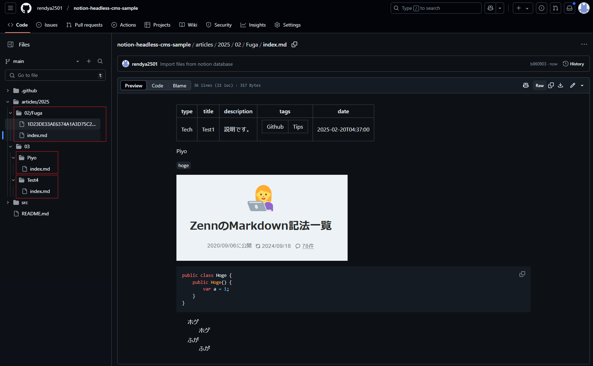

## 概要

この記事では、GitHub Actionsを利用して、NotionのデータをMarkdown形式で抽出し、GitHubに自動的に反映させる仕組みの構築方法を紹介します。

<!-- 
## 概要

本記事では、Notion のデータベースを記事管理の中心に据え、GitHub Actions を活用して Notion の内容をマークダウン形式で出力し GitHub リポジトリに同期させる機能の実現方法を解説します。  

この方法を使うことで、Notion 上で記事を作成・編集するだけで、自動的に GitHub に反映されるようになります。
-->

## 背景

元々、TIL（Today I Learned）の取り組みをしていましたが、技術スタックごとにディレクトリを分ける方法に限界を感じていました。  
特に複数の技術が関わる場合、どのディレクトリに配置すればよいのか判断に迷うことが多かったのです。  
例えば、「C#でEFCoreを使ってデータベース操作をする」という記事を書いた場合、C#？ EFCore？ データベース？ どのディレクトリが最適なのか決めかねる、といった具合です。  

<!-- 
何かよい方法はないものか？と探していたところ、Notionのデータベースでタグを使って技術スタックを管理する方法はどうか？という
ある程度、Notionの仕組みも構築して、いざ運用を初めて見たは良いものの、これだと何かしらの学習活動をしているにも関わらず、GitHubには反映されないのが勿体無いと感じました。
-->

何か良い方法はないかと模索していたところ、Notionのデータベース機能を活用し、タグを使って技術スタックを管理する方法を思いつきました。  
実際にNotionである程度の仕組みを構築し、運用を始めてみたのですが、一つ問題がありました。  
**学習記録はNotionに蓄積されるものの、GitHubには反映されない**ため、せっかくの学習成果が形として残らないのがもったいないと感じたのです。  

<!-- 
当時の理想としては、

1. Notionの勉強用データベースにその日の学習記録をつける  
2. Notionデータベースから、その記事のマークダウンを生成し、勉強用リポジトリにプッシュする  

といった事が出来たら「完璧だな」、と思っていました。  
余り期待せずにそれっぽいことを調べていたら、似たような事をしている人達を発見しました。  
「求めていたのはまさにこれだよ！」という事で、意気揚々と実装してみようとしてみましたが、全然分からない…   
-->

当時考えた理想の運用は、  

1. Notionのデータベースにその日の学習記録をつける  
2. Notionのデータからマークダウンを生成し、GitHubの学習用リポジトリに自動でプッシュする  

この流れが実現できたら「完璧だな」と思い、方法を調べ始めました。  
すると、**まさに求めていた仕組みを実現している人たちを発見！**  
意気揚々と実装を試みましたが、思った以上に難しく、すぐには理解できませんでした。  
<!-- 
GitHub Actionsやら、それっぽいコードやらは紹介されているけど、ゼロベースで構築方法を紹介してくれている記事は全然ない…。
当時は時間も無かったので、なかば諦め気味でしたが、どうしても諦めきれず…。
GitHub Actionsの勉強をしたり、AIの力を駆使して、なんとか実装する事が出来たので、自分のようにゼロベースからの構築方法が分からない人の参考になればと思って記事を書くことにしました。   -->

GitHub Actionsやスクリプトを紹介している記事はあるものの、ゼロから構築する方法を詳しく解説しているものは見つからず…。  
当時は時間もなかったため、半ば諦めかけていました。  
しかし、どうしても実現したかったので、GitHub Actionsを一から学び、AIの力も借りながら試行錯誤した結果、なんとか実装することが出来ました。  

これらの経験を元に、ゼロベースで構築方法が分からず苦労した当時の自分のような人のために、この記事を書こうと思いました。  

<!-- 
日々の学習記録をNotionにまとめたいが、GitHubにも反映させたいと考えました。  
そこで、NotionをヘッドレスCMSとして利用し、GitHub Actionsで自動的にMarkdownに変換してGitHubにプッシュする方法を実現しました。

参考サイトやAIを駆使した結果、なんとか実現する事が出来たので、自分のように何の知識もない人の参考になればと思って書きました。  
(技術記事のネタにもなるし…)  

NotionをヘッドレスCMSとして運用させる記事はあれど、具体的な構築方法まで解説してくれているサイトがありませんでした。(自分が無知なだけで、分かる人が見たらそれで十分なのかもしれません)  

完全にこちらの記事[(結局Githubに学習履歴を統一した方が諸々良かった)](https://zenn.dev/bun913/articles/study-history-on-github)の通りなので、そのまま引用させて頂きます。  

>私はアウトプットを大事にしたいと思いつつも以下のような悩みを持っておりました。
>
>- 毎日何かしらの学習をしているので、毎日学習履歴を残したい
>- エンジニアたるもの、どうせならGithub に草を生やしたい
>- コーディング系の学習はしていなくても、読書したり資格の学習をしている日があるが、Github のプロフィールだけ見ると何もしていないように見える
>- また資格学習のために外部サービスを使って勉強しているけど同じく何も勉強していないように見える -->

<!-- 
## なぜこの記事を書いたのか？  

NotionをヘッドレスCMSとして運用させる記事はあれど、具体的な構築方法まで解説してくれているサイトがありませんでした。(自分が無知なだけで、分かる人が見たらそれで十分なのかもしれません)  
参考サイトやAIを駆使した結果、なんとか実現する事が出来たので、自分のように何の知識もない人の参考になればと思って書きました。  
(技術記事のネタにもなるし…)  

システムを構築するにあたり、筆者はGitHub Actionsの知識はありませんでした。  
システムを構築する事は出来ましたが、拙い部分があるかもしれませんので、そこはご了承ください。  
また、一番得意な言語がC#だったので、C#中心の調査をして実装しています。  
似たような境遇の方の参考になれば幸いです。   
-->

## ヘッドレスCMS

このようなシステムを `ヘッドレスCMS` と言うらしいです。  
先人たちがそのように紹介していたので、自分も同じように使わせて貰います。  

- [NotionヘッドレスCMS化記録 (3) GitHub Actionsと自動デプロイ | lacolaco's marginalia](https://blog.lacolaco.net/posts/notion-headless-cms-3/)  

### ヘッドレスCMSとは？

AIの回答をそのまま引用しておきます。  

>ヘッドレスCMS（Headless CMS）とは、コンテンツの管理（バックエンド）と表示（フロントエンド）を分離したコンテンツ管理システムのことです。通常のCMS（例えば WordPress など）は、管理画面でコンテンツを作成・編集し、同じシステム内でウェブサイトとして表示します。一方、ヘッドレスCMSはコンテンツ管理のみを担当し、APIを通じてデータを外部のWebサイトやアプリに提供します。
>
>「本システムでは、Notion をコンテンツ管理のバックエンドとして利用し、GitHub Actions を通じてデータを変換・反映するため、ヘッドレスCMS の概念に当てはまります。」  

だそうです。  

## デモ

まずNotionにこんな感じのデータベースがありまして、  


こんな感じの記事を書いたとします。  


GitHubActionsを実行しまして、


それが成功するとNotionの記事がマークダウンとして生成され、GitHubに草が生えます。  



## 開発環境  

- Win11 HOME 24H2  
- .Net8  
- VSCode  

## 実装・解説

以下の手順で実装していきます。  

1. Notionの設定  
   1. Notionデータベースを作成&プロパティの設定  
   2. NotionAPI利用のためのインテグレーショントークンの取得
   3. Notion Database ID の取得
2. GitHubリポジトリの設定
   1. リポジトリの作成とプロジェクト構成
   2. リポジトリのシークレットに登録
   3. リポジトリのpermissionsの設定
3. C#プロジェクトの作成  
4. GitHubActionsの設定  

### 1. Notionの設定

#### 1-1. Notionデータベースを作成&プロパティの設定

まずはNotionで記事管理用のデータベースを作成します。  
フルページのデータベースを作成して適当に名前を付けてください。  
※自分の場合は、とりあえず`notion-headless-cms-sample-database`とつけておきました。  

次にプロパティを設定していきます。  
以下のプロパティを追加してください。  
GitHub連携の際に必ず必要となるプロパティです。  

| プロパティ | プロパティの種類 | 用途 |
|---|---|---|
| **Title** | タイトル | 記事本体のタイトル名です。ヘッダー情報に含めます。 |
| **Slug** | テキスト | GitHubで記事のディレクトリ名になります。指定しない場合はタイトルがディレクトリ名となります。 |
| **PublishedAt** | 作成日時 | 記事を作成した日時です。ヘッダー情報に含めます。 |
| **Type** | セレクト | Zennのように記事が`Idea`か`Tech`なのかを示します。ヘッダー情報に含めます。 |
| **Tags** | マルチセレクト | 技術スタック等を選択するものです。ヘッダー情報に含めます。 |
| **RequestPublishing** | チェックボックス | 記事公開フラグです。これにチェックがついている記事が公開の対象となります。 |


#### 1-2. NotionAPI利用のためのインテグレーショントークンの取得

こちらの記事([Notion APIのインテグレーショントークン](https://programming-zero.net/notion-api-setting/))を参考に`インテグレーショントークン`なるものを取得してください。  
`GitHubActions` の `Seacrets` で使うのでメモしておいてください。  

#### 1-3. Notion Database ID の取得

同じくこちらの記事([【Notion】データベースIDを確認しよう｜あまてぃ](https://note.com/amatyrain/n/nb9ebe31dfab7))を参考にデータベースIDを取得してください。  

簡単なのでそのまま引用させて頂きます。  
>③URLからデータベースIDを確認
>
>URLは「`https://www.notion.so/XXXXXXXX?v=YYYYYYYY`」といった形式となっていますが、その「`XXXXXXXX`」の部分がデータベースIDとなります  

こちらも `GitHubActions` の `Seacrets` で使うのでメモしておいてください。  

### 2. GitHubリポジトリの設定  

#### 2-1. リポジトリの作成とプロジェクト構成

サンプルとして `notion-headless-cms-sample` というリポジトリ名でリポジトリを作成してください。  

プロジェクト構成は以下のようになります。  

``` txt
notion-headless-cms-sample/
  ├── .github/
  │   ├── src/
  │   │   ├── Program.cs
  │   │   ├── GithubActionsTest.csproj
  │   │   └── .gitignore
  │   └── workflows/
  │       └── workflow.yml
  └── articles/
      └── yyyy/
          ├── mm/
          │   ├── Hoge.md
          │   └── Fuga.md
          └── mm/
              └── Piyo.md
```

#### 2-2. リポジトリのシークレットに登録

こちらの記事([GitHub Actions のシークレット情報と変数の設定方法 #GitHubActions - Qiita](https://qiita.com/mkin/items/75a4928a1fafe5eacd17))が分かりやすいと思いますので、参考にしながら設定してください。  

- `リポジトリのSettingsタブ`
- `Secrets and variablesのアコーディオン内のActions`  
- `New repository secretボタン` を押下  

Notionの設定時にメモしておいた値を格納してください。  

| 変数名 | 格納する値 |
|---|---|
| **NOTION_AUTH_TOKEN** | 1-2. で取得した **Notion APIのインテグレーショントークン** |
| **NOTION_DATABASE_ID** | 1-3. で取得した **Notion Database ID** |
| **USER_EMAIL** | githubに登録しているメールアドレス |
| **USER_NAME** | githubのユーザー名 |

メールアドレスとユーザー名に関してはGitHubActionsを実行した時に草を生やすために必要です。  

#### 2-3. リポジトリのpermissionsの設定

次にリポジトリの`Workflow permissions`を設定します。  

- `リポジトリのSettingsタブ`  
- `Actionsのアコーディオン内のGeneral`  
- `Workflow permissions`  

これを `Read and Write permissions` に変更してください。

初期状態は `Read repository contents and packages permissions` となっていますが、この状態でGitHubActionsを実行すると次の画像のように403エラーとなってしまいます。  


- **Read and Write permissions(読み取りと書き込みの権限)**  
ワークフローには、すべてのスコープに対してリポジトリへの読み取りと書き込みの権限があります。  
- **Read repository contents and packages permissions(リポジトリのコンテンツとパッケージの読み取り権限)**  
ワークフローは、リポジトリのコンテンツとパッケージのスコープに対してのみ読み取り権限を持ちます。  

### 3. C#プロジェクトの作成  

GitHub Actionsにて実行するスクリプトは、[(yucchiy/notion-to-markdown)](https://github.com/yucchiy/notion-to-markdown)様のコードを元に加筆修正させていただきました。  
このコードがあったから実現出来たといっても過言ではありません。  

<!-- `Program.cs` に記述するコードの概要を解説しながら書く（例）   -->

### 4. GitHubActionsの設定  

GitHub Actionsを使い、定期的にNotionからMarkdownを取得するように設定します。  
以下のYAMLファイルを作成（`.github/workflows/workflow.yaml`）  

```yml
name: Notion to Markdown Workflow

on:
  workflow_dispatch:
  schedule:
    - cron: '30 14 * * *' # 23:30 JST

jobs:
  import_markdown:
    runs-on: ubuntu-latest

    steps:
      - name: Checkout repository
        uses: actions/checkout@v4

      - name: Set up .NET
        uses: actions/setup-dotnet@v4
        with:
          dotnet-version: '8.0'

      - name: Restore dependencies
        run: dotnet restore .github/src/notion-to-markdown.csproj

      - name: Build
        run: dotnet build .github/src/notion-to-markdown.csproj --configuration Release --no-restore

      - name: Publish
        run: dotnet publish .github/src/notion-to-markdown.csproj --configuration Release --output ./out --no-build

      - name: Run Notion to Markdown
        run: |
          dotnet ./out/notion-to-markdown.dll \
            ${{ secrets.NOTION_AUTH_TOKEN }} \
            ${{ secrets.NOTION_DATABASE_ID }} \
            "articles/{{publish|date.to_string('%Y/%m')}}/{{slug}}"

      - name: Check for changes
        if: env.EXPORTED_COUNT == '0'
        run: exit 0

      - name: Commit exported markdown files
        run: |
          git config --global user.email "${{ secrets.USER_EMAIL }}"
          git config --global user.name "${{ secrets.USER_NAME }}"
          git add articles/
          git commit -m "Import files from notion database" || exit 0
          git push
```

## 参考・リンク

[Notionでブログを書く | Yucchiy's Note](https://blog.yucchiy.com/2022/05/blogging-with-notion/)  
[C#でCustom GitHub Actionを書く | Yucchiy's Note](https://blog.yucchiy.com/2022/05/implement-custom-github-action-with-csharp/)  

[NotionヘッドレスCMS化記録 (3) GitHub Actionsと自動デプロイ | lacolaco's marginalia](https://blog.lacolaco.net/posts/notion-headless-cms-3/)

[結局Githubに学習履歴を統一した方が諸々良かった](https://zenn.dev/bun913/articles/study-history-on-github)  

## リポジトリ

この記事で作成した成果物を置いています。  
参考にしてください。  

[rendya2501/notion-headless-cms-sample](https://github.com/rendya2501/notion-headless-cms-sample)  

<!--
## メモ

Notion をヘッドレスCMS として活用し、記事を GitHub に自動で反映させる仕組みを構築する方法を紹介します。  


## そもそもNotionをヘッドレスCMSとして使うとは？  

普通のCMS（WordPressなど）と違い、NotionをヘッドレスCMSとして使う場合は以下のような仕組みになります。  

1. Notionのデータベースに記事を作成  
2. APIを使ってデータを取得  
3. 取得したデータをMarkdownに変換  
4. GitHub Actionsで定期的に取得＆デプロイ  

この流れを実現すると、**Notionで記事を管理しながら、自動的にGitHubにMarkdownとして保存する** ことができます。  


- **Notion**（記事を管理するCMS代わり）  
- **Notion API**（Notionのデータを取得する）  
- **GitHub & GitHub Actions**（記事データをMarkdownに変換し管理する）  
- **C#**（APIと連携するプログラムを作成）   


## まとめ  

- NotionをヘッドレスCMSとして活用するメリット  
- 実装の流れをおさらい  
- 今後の改善点や発展的な使い方  

### 🎯 こんな人に役立つ記事  

- **NotionをCMSとして使いたいが、構築方法が分からない人**  
- **GitHub ActionsでNotionの記事を自動管理したい人**  
- **実際に動くサンプルを試してみたい人**  

-->