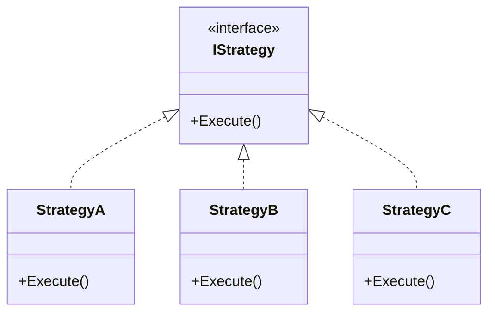

# ストラテジーパターン実践ガイド

## 問題提起

コンボボックスなどで `A`、`B`、`C` のような選択肢を選ぶUIにおいて、選択肢ごとに異なる処理を実装しなければならない状況を想定します。経験のある方なら、ストラテジーパターンが自然と頭に浮かぶ場面です。

## この記事について

GoFのストラテジーパターンの基本実装から、DIコンテナを活用した現代的な設計、.NET 8で導入されたKeyed Servicesの調査・研究まで、「なぜそうするのか」を軸に段階的に解説します。

**対象読者*  

- C#/.NETの開発経験あり
- DIコンテナの基本的な使い方を知っている
- デザインパターンの基礎知識あり

## 目次

- [ストラテジーパターン実践ガイド](#ストラテジーパターン実践ガイド)
  - [問題提起](#問題提起)
  - [この記事について](#この記事について)
  - [目次](#目次)
  - [1. 問題提起：なぜif文ではダメなのか](#1-問題提起なぜif文ではダメなのか)
    - [典型的なパターン](#典型的なパターン)
  - [2. ステップ1：GoF ストラテジーパターン（歴史的背景）](#2-ステップ1gof-ストラテジーパターン歴史的背景)
    - [GoFの教科書的実装](#gofの教科書的実装)
    - [GoF実装が抱える制約](#gof実装が抱える制約)
      - [1. DIコンテナが存在しなかった](#1-diコンテナが存在しなかった)
      - [2. 外部依存を持てない](#2-外部依存を持てない)
      - [3. テストが書けない](#3-テストが書けない)
    - [Contextクラスの存在意義と現代での位置づけ](#contextクラスの存在意義と現代での位置づけ)
    - [GoF的なContextの行方](#gof的なcontextの行方)
  - [3. ステップ2：Factoryパターン（Simple Factory）の導入](#3-ステップ2factoryパターンsimple-factoryの導入)
  - [4. ステップ3：IEnumerable注入 + StrategyContext方式（最推奨）](#4-ステップ3ienumerable注入--strategycontext方式最推奨)
    - [最小構成での実装](#最小構成での実装)
    - [本番を想定した実装](#本番を想定した実装)
  - [5. ステップ4：Keyed Services（.NET 8以降）](#5-ステップ4keyed-servicesnet-8以降)
    - [最小構成での実装](#最小構成での実装-1)
    - [動的選択への適用は推奨しない](#動的選択への適用は推奨しない)
    - [Keyed Servicesの本来の価値（静的選択と\[FromKeyedServices\]）](#keyed-servicesの本来の価値静的選択とfromkeyedservices)
  - [6. コラム1：サービスロケーターパターン（なぜ避けるべきか）](#6-コラム1サービスロケーターパターンなぜ避けるべきか)
    - [絶対に避けるべきパターン](#絶対に避けるべきパターン)
    - [なぜアンチパターンなのか](#なぜアンチパターンなのか)
    - [IServiceProviderを使って良い唯一の例外](#iserviceproviderを使って良い唯一の例外)
  - [7. コラム2：キャプティブ依存（ライフタイムの罠）](#7-コラム2キャプティブ依存ライフタイムの罠)
    - [キャプティブ依存とは](#キャプティブ依存とは)
    - [記事内の実装で潜む問題](#記事内の実装で潜む問題)
    - [修正案の選び方](#修正案の選び方)
    - [開発時の検出方法](#開発時の検出方法)
  - [8. まとめ](#8-まとめ)
    - [パターン総合比較](#パターン総合比較)
  - [参考資料](#参考資料)

## 1. 問題提起：なぜif文ではダメなのか

### 典型的なパターン

```csharp
// ❌ よくある実装
public void ProcessOrder(string orderType)
{
    if (orderType == "A")
    {
        Console.WriteLine("Aの処理");
    }
    else if (orderType == "B")
    {
        Console.WriteLine("Bの処理");
    }
    else if (orderType == "C")
    {
        Console.WriteLine("Cの処理");
    }
}
```

**問題点:**

❌ **Open/Closed原則違反（OCP）:** 新しい選択肢Dを追加するたびにこのメソッドを修正しなければならず、既存動作が壊れるリスクが生まれます。

❌ **テストの困難さ:** Aの処理だけを単独でテストできません。

❌ **密結合:** 各処理のロジックが混在しており、独立して変更できません。

これを解決するのが**ストラテジーパターン**です。振る舞いをクラスとして切り出し、インターフェースを通じて交換可能にする——これがStrategyパターンの本質です。次のステップから実装を追っていきましょう。

> **💡 ifがすべてダメというわけではない**
>
> 分岐が2〜3個で今後増えない見込みなら、シンプルなifのままで十分です。Strategyが力を発揮するのは、選択肢が増える・仕様が変わるといった変更が起きやすい箇所です。

## 2. ステップ1：GoF ストラテジーパターン（歴史的背景）

### GoFの教科書的実装

ストラテジーパターンの基本構造はこうなっています。処理ごとに独立したクラスを用意し、共通のインターフェースで統一します。



```csharp
// Strategy インターフェース
public interface IStrategy
{
    void Execute();
}

public class StrategyA : IStrategy
{
    public void Execute() => Console.WriteLine("Aの処理");
}

public class StrategyB : IStrategy
{
    public void Execute() => Console.WriteLine("Bの処理");
}

public class StrategyC : IStrategy
{
    public void Execute() => Console.WriteLine("Cの処理");
}

// Contextクラス：戦略の保持と切り替えを管理する仲介者
public class Context
{
    private IStrategy _strategy;

    public Context(IStrategy strategy)
    {
        _strategy = strategy;
    }

    public void SetStrategy(IStrategy strategy)
    {
        _strategy = strategy;
    }

    public void ExecuteStrategy()
    {
        _strategy?.Execute();
    }
}
```

**利用例**  

```csharp
var context = new Context(new StrategyA());
context.ExecuteStrategy(); // Output: Aの処理

// 動的に切り替え
context.SetStrategy(new StrategyB());
context.ExecuteStrategy(); // Output: Bの処理
```

**評価**  

✅ メリット:

- 教科書的で理解しやすい
- 動的な戦略切り替えが直感的
- 共通の前後処理をContextに集約できる

❌ デメリット:

- `new`演算子による密結合（DIが使えない）
- テストしづらい（モック不可）
- DIが当たり前の現代では冗長になりやすい

### GoF実装が抱える制約

教科書通りの実装なのに、現代のプロジェクトでそのまま見かけることはほぼありません。理由はGoFパターンが生まれた当時と現代では前提条件が大きく異なるからです。

#### 1. DIコンテナが存在しなかった

GoFが書かれた1994年当時、DIコンテナは存在しませんでした。依存するオブジェクトは自分で`new`するのが当たり前であり、上記の実装はその制約の中での最善でした。現代では依存関係の管理はDIコンテナが担うため、`new`で生成する構造は設計上の制約になります。

#### 2. 外部依存を持てない

戦略クラスを`new`で生成する構造では、DBアクセスや外部APIといった依存を戦略に持たせることができません。

```csharp
// ❌ newで生成するため、DbContextを注入できない
var context = new Context(new StrategyA()); // StrategyAにDbContextを渡せない
```

#### 3. テストが書けない

具体クラスを直接`new`しているため、テスト時にモックへ差し替えることができません。

```csharp
// ❌ StrategyAをモックに差し替えられない
var context = new Context(new StrategyA());
```

### Contextクラスの存在意義と現代での位置づけ

DIコンテナが存在しなかった当時、クライアントコードは具体クラスを直接知っている必要があり、Contextはその問題を解決する「仲介者」として必要な存在でした。

```csharp
// 1994年当時の問題：具体クラスへの直接依存
public class Application
{
    public void Run()
    {
        // ❌ クライアントが具体クラスに依存している
        IStrategy strategy = new ConcreteStrategyA();
        strategy.Execute();
    }
}
```

DIコンテナの普及により、Contextの役割のほとんどをコンテナ側が担うようになりました。

| Contextの役割 | 現代の代替手段 | 理由 |
| --- | --- | --- |
| 戦略の保持 | DIコンテナ | コンテナがライフタイム管理 |
| 動的切り替え | StrategyContext/Factory | より明示的で柔軟 |
| 共通処理 | Middleware/Decorator | 横断的関心事の分離 |
| 依存性の隠蔽 | DIによる注入 | 疎結合が自然に実現 |

Contextが担っていた「戦略の保持・選択・実行」という責務自体は現代でも変わりません。変わったのはその実現手段です。

```txt
GoFのContext       → _strategyフィールドに状態を保持（ステートフル）
本記事のContext   → DIコンテナ経由で毎回解決（ステートレス）
```

本記事ではこの現代的な実装をStrategyContextと呼びます。同じ構造をResolver・Factoryと呼ぶ実装も多く、命名に業界標準はありません。

### GoF的なContextの行方

GoF的なContextが有効な場面を現代の.NET開発で見つけようとすると、どのケースも別のパターンや仕組みで代替できてしまいます。状態に応じてリアルタイムに戦略を切り替えるケースはStateパターンの領域に近く、UIの状態管理はFlux/MVVM、権限制御はPolicyベース認可などが担います。Strategyパターンの文脈でGoF的なContextをあえて実装する理由は現代においてほぼ見当たりません。

GoFのContextが担っていた「戦略を保持して実行する」という役割は、現代ではDIコンテナとStrategyContextが自然に引き受けています。Contextというクラスを明示的に作らなくても、その責務はすでに別の形で満たされています。

## 3. ステップ2：Factoryパターン（Simple Factory）の導入

Factoryパターン（Simple Factory）はContextクラスを必要とせず、「選択肢に応じた戦略を返す」という責務を1か所に集約します。enumを渡せばそれに応じた戦略が返ってくる——選択肢に応じた処理を呼び出せれば十分なケースで有効です。

```csharp
public enum OptionType { A, B, C }

public interface IStrategy
{
    void Execute();
}

public class StrategyA : IStrategy
{
    public void Execute() => Console.WriteLine("Aの処理");
}

public class StrategyB : IStrategy
{
    public void Execute() => Console.WriteLine("Bの処理");
}

public class StrategyC : IStrategy
{
    public void Execute() => Console.WriteLine("Cの処理");
}

public class StrategyFactory
{
    public static IStrategy Create(OptionType option)
    {
        return option switch
        {
            OptionType.A => new StrategyA(),
            OptionType.B => new StrategyB(),
            OptionType.C => new StrategyC(),
            _ => throw new ArgumentException($"無効なオプション: {option}")
        };
    }
}
```

**利用例**  

```csharp
var option = OptionType.B;
var strategy = StrategyFactory.Create(option);
strategy.Execute(); // Output: Bの処理
```

**評価**  

✅ メリット:

- シンプルで理解しやすい
- 実装が速い
- パフォーマンスが良い

❌ デメリット:

- `new`演算子による密結合（DI不可）
- テストしづらい（モック不可）
- Open/Closed原則違反（新しい戦略追加時にFactory修正必須）
- 戦略が外部依存を持つ場合に対応できない

プロトタイプや小規模スクリプトには十分なアプローチです。ただし戦略を`new`で生成する構造上、外部サービスへの依存やモックへの差し替えが必要になった途端に限界が来ます。次のステップでDIを導入して改善します。

## 4. ステップ3：IEnumerable注入 + StrategyContext方式（最推奨）

コンボボックスの「動的選択」に対応する、現代的なDI実装のメインパターンです。

### 最小構成での実装

詳細実装に入る前に、構造全体を掴んでおきましょう。本質はこれだけです。

```csharp
// 選択肢をenumで定義する
public enum OptionType { A, B, C }

// ① インターフェースにキーを持たせる
public interface IStrategy
{
    OptionType SupportedOption { get; }
    void Execute();
}

// ② 各戦略を実装する
public class StrategyA : IStrategy
{
    public OptionType SupportedOption => OptionType.A;
    public void Execute() => Console.WriteLine("Aの処理");
}
// StrategyB、StrategyCも同様

// ③ StrategyContextで選んで実行する
public class StrategyContext
{
    private readonly Dictionary<OptionType, IStrategy> _cache;

    public StrategyContext(IEnumerable<IStrategy> strategies)
    {
        _cache = strategies.ToDictionary(s => s.SupportedOption);
    }

    public void Execute(OptionType option) => _cache[option].Execute();
}

// ④ DIに登録する
services.AddTransient<IStrategy, StrategyA>();
services.AddTransient<IStrategy, StrategyB>();
services.AddTransient<IStrategy, StrategyC>();
services.AddScoped<StrategyContext>();

// ⑤ 使う側はStrategyContextを受け取るだけ
public class DataProcessingService
{
    private readonly StrategyContext _context;

    public DataProcessingService(StrategyContext context)
    {
        _context = context;
    }

    public void Process(OptionType userSelection)
    {
        _context.Execute(userSelection);
    }
}
```

構造は「インターフェース → 各実装 → StrategyContext → DI登録 → 利用側」の5ステップです。以降はこれを本番を想定した実装に近づけていきます。

> **💡 StrategyContextの責務について**
>
> `StrategyContext`は「戦略を解決する」と「戦略を実行する」の2つの責務を持っています。単一責任原則の観点では分離すべきとも言えますが、「解決して実行する」という一連の操作を1箇所に閉じ込めることで呼び出し側がシンプルになります。実用上はこの兼任形式が多くの現場で採用されており、責務の兼任を意識した上で選択するのであれば問題ありません。

### 本番を想定した実装

:::details 本番を想定した実装（非同期・エラーハンドリング・インターフェース対応）

**Enum・DTO定義**  

```csharp
public enum OptionType { A, B, C }

// 入力DTO：呼び出し側から戦略へ渡すパラメータ
// StrategyContextの必須要素ではなく、実際のアプリに合わせて自由に設計してください
public record StrategyRequest(
    string UserId,
    string OrderId,
    CancellationToken CancellationToken = default
);

// 出力DTO：戦略から呼び出し側へ返す処理結果
// 同上
public record StrategyResponse(
    bool Success,
    string Message,
    string? ResultData = null
);
```

**Strategy インターフェース（非同期対応）**  

```csharp
public interface IStrategy
{
    OptionType SupportedOption { get; }
    Task<StrategyResponse> ExecuteAsync(StrategyRequest request);
}
```

**具体的な戦略実装**  

```csharp
public class StrategyA : IStrategy
{
    private readonly ILogger<StrategyA> _logger;
    private readonly IExternalService _externalService;

    public OptionType SupportedOption => OptionType.A;

    public StrategyA(ILogger<StrategyA> logger, IExternalService externalService)
    {
        _logger = logger;
        _externalService = externalService;
    }

    public async Task<StrategyResponse> ExecuteAsync(StrategyRequest request)
    {
        try
        {
            _logger.LogInformation(
                "StrategyA: 処理開始 UserId={UserId} OrderId={OrderId}",
                request.UserId, request.OrderId
            );

            var result = await _externalService.ProcessAsync(
                request.OrderId,
                request.CancellationToken
            );

            return new StrategyResponse(true, "Aの処理が完了しました", result);
        }
        catch (Exception ex)
        {
            _logger.LogError(ex, "StrategyA: エラー発生");
            return new StrategyResponse(false, $"エラーが発生しました: {ex.Message}");
        }
    }
}
// StrategyB、StrategyCも同様の構造で実装する
```

**StrategyContext（IServiceProvider不使用）**  

```csharp
/// <summary>
/// テスト時にモックへ差し替え可能にするためのインターフェース。
/// 呼び出し側はこのインターフェースにのみ依存するため、
/// StrategyContextの実装が変わっても影響を受けない。
/// </summary>
public interface IStrategyContext
{
    Task<StrategyResponse> ExecuteAsync(OptionType option, StrategyRequest request);
}

public class StrategyContext : IStrategyContext
{
    private readonly Dictionary<OptionType, IStrategy> _strategyCache;
    private readonly ILogger<StrategyContext> _logger;

    public StrategyContext(
        IEnumerable<IStrategy> strategies,
        ILogger<StrategyContext> logger)
    {
        _logger = logger ?? throw new ArgumentNullException(nameof(logger));
        // IEnumerable<IStrategy>をDictionaryに変換してキャッシュする
        // → FirstOrDefaultによるO(n)検索ではなく、O(1)で目的の戦略を取得するため
        _strategyCache = strategies?.ToDictionary(s => s.SupportedOption)
            ?? throw new ArgumentNullException(nameof(strategies));

        _logger.LogInformation(
            "StrategyContext initialized with {Count} strategies",
            _strategyCache.Count
        );
    }

    public async Task<StrategyResponse> ExecuteAsync(
        OptionType option,
        StrategyRequest request)
    {
        _logger.LogInformation("Executing strategy for option: {Option}", option);

        if (!_strategyCache.TryGetValue(option, out var strategy))
        {
            _logger.LogWarning("Strategy not found for option: {Option}", option);
            return new StrategyResponse(false, $"Strategy not found for option: {option}");
        }

        return await strategy.ExecuteAsync(request);
    }
}
```

**DI登録**  

```csharp
public static class ServiceCollectionExtensions
{
    public static IServiceCollection AddStrategies(this IServiceCollection services)
    {
        services.AddTransient<IStrategy, StrategyA>();
        services.AddTransient<IStrategy, StrategyB>();
        services.AddTransient<IStrategy, StrategyC>();

        // ⚠️ ライフタイムの整合性に注意（コラム2参照）
        services.AddScoped<IStrategyContext, StrategyContext>();

        return services;
    }
}

// Program.csでの使用例
builder.Services.AddStrategies();

// 開発環境でのキャプティブ依存検出（コラム2参照）
// ⚠️ builder.Environment はASP.NET Core固有です。
// コンソールアプリ・Blazor・MAUIなどでは IHostEnvironment.IsDevelopment() を使用してください。
builder.Services.Configure<ServiceProviderOptions>(options =>
{
    options.ValidateScopes = builder.Environment.IsDevelopment();
    options.ValidateOnBuild = builder.Environment.IsDevelopment();
});
```

**使用例（コンボボックスのUI処理）**  

```csharp
public class DataProcessingService
{
    private readonly IStrategyContext _context;
    private readonly ILogger<DataProcessingService> _logger;

    // ✅ 依存関係がコンストラクタで明示的に宣言されている
    public DataProcessingService(
        IStrategyContext context,
        ILogger<DataProcessingService> logger)
    {
        _context = context;
        _logger = logger;
    }

    // コンボボックスのユーザー選択を受け取って処理する
    public async Task ProcessAsync(OptionType userSelection, string userId, string orderId)
    {
        var request = new StrategyRequest(
            UserId: userId,
            OrderId: orderId
        );

        var result = await _context.ExecuteAsync(userSelection, request);

        if (result.Success)
            _logger.LogInformation("成功: {Message}", result.Message);
        else
            _logger.LogWarning("失敗: {Message}", result.Message);
    }
}
```

> **💡 TransientとDictionaryキャッシュについて**
>
> 戦略をTransientで登録していますが、StrategyContextはコンストラクタで受け取った`IEnumerable<IStrategy>`をDictionaryにキャッシュします。そのためScopedなStrategyContext内では、リクエストの間は同じ戦略インスタンスが使い回されます（事実上Scopedと同じ動作）。
>
> これ自体は多くの場合問題ありませんが、戦略クラスがリクエストをまたいで状態を持つ設計の場合は注意が必要です。戦略をステートレス（状態を持たない）に保つことで、この挙動は安全になります。

:::

**評価**  

✅ メリット:

- IServiceProviderを一切使わない（最重要）
- 完全にDI統合、テストが容易（モック可能）
- Open/Closed原則準拠（戦略追加時にStrategyContextを修正不要）
- 各戦略が独立してテスト可能
- .NETバージョン制約なし、非同期処理に対応

❌ デメリット:

- 初期セットアップがやや複雑

IEnumerable注入 + StrategyContext方式は、.NETのDIコンテナが標準でサポートしている機能であり、サービスロケーターを使わずに複数実装を扱う方法として.NETコミュニティで広く採用されているアプローチです。

## 5. ステップ4：Keyed Services（.NET 8以降）

> **このステップについて**
> このステップは .NET 8で追加されたKeyed Servicesの調査・研究を目的としたステップです。実用的な実装としてはステップ3の方式で十分です。そのため、最小構成での実装と説明のみとし、本番を想定した実装は行いません。

.NET 8で導入された機能で、`AddKeyedTransient` / `AddKeyedScoped` / `AddKeyedSingleton`という登録メソッドが追加され、同じインターフェースの実装をキー（今回はenum）で区別して登録・解決できるようになりました。

### 最小構成での実装

enumキーで戦略を登録できるため、次のような実装が可能です。

```csharp
public enum OptionType { A, B, C }

// ① キーを指定して登録する
services.AddKeyedTransient<IStrategy, StrategyA>(OptionType.A);
services.AddKeyedTransient<IStrategy, StrategyB>(OptionType.B);
services.AddKeyedTransient<IStrategy, StrategyC>(OptionType.C);

// ② FactoryでIServiceProviderを閉じ込め、キーを指定してサービスを取得する
public class KeyedStrategyFactory
{
    private readonly IServiceProvider _serviceProvider;

    public KeyedStrategyFactory(IServiceProvider serviceProvider)
    {
        _serviceProvider = serviceProvider;
    }

    public IStrategy GetStrategy(OptionType option)
        => _serviceProvider.GetRequiredKeyedService<IStrategy>(option);
}

// ③ StrategyContextで実行する
public class KeyedStrategyContext
{
    private readonly KeyedStrategyFactory _factory;

    public KeyedStrategyContext(KeyedStrategyFactory factory)
    {
        _factory = factory;
    }

    public void Execute(OptionType option) => _factory.GetStrategy(option).Execute();
}

// ④ DIに登録する
services.AddSingleton<KeyedStrategyFactory>();
services.AddScoped<KeyedStrategyContext>();

// ⑤ 使う側はStrategyContextを受け取るだけ（ステップ3と同じ）
public class DataProcessingService
{
    private readonly KeyedStrategyContext _context;

    public DataProcessingService(KeyedStrategyContext context)
    {
        _context = context;
    }

    public void Process(OptionType userSelection)
    {
        _context.Execute(userSelection);
    }
}
```

### 動的選択への適用は推奨しない

Keyed ServicesはenumをキーにしてDI登録できますが、動的選択には不向きです。理由は2つあります。

① 複雑性が増す — サービスロケーターパターンが伴う

キーを指定した解決には`IServiceProvider`の`GetRequiredKeyedService`を使うほかなく、広義のサービスロケーターパターンに陥ります。  
これを避けるためにFactoryで隠蔽すると、ステップ3より複雑な構造になります。

② 優位性がない — ステップ3で十分

enumキーによるマジックストリング排除や型安全はメリットですが、ステップ3のIEnumerable方式でも同様に実現できます。

以上の理由から、動的選択においてKeyed Services方式を採用する理由はほぼありません。

### Keyed Servicesの本来の価値（静的選択と[FromKeyedServices]）

Keyed Servicesが真価を発揮するのは「このサービスには常にこの実装」という静的選択の場面です。  
コンパイル時点でどの戦略を使うかが決まっている場合、`[FromKeyedServices]`アノテーションで直接注入でき、FactoryもStrategyContextも不要です。

**実装例**  

```csharp
// ✅ 各サービスが固定の戦略を直接受け取る（FactoryもStrategyContextも不要）
public class ProductOrderService
{
    private readonly IStrategy _strategy;

    public ProductOrderService(
        [FromKeyedServices(OptionType.A)] IStrategy strategy)
    {
        _strategy = strategy;
    }

    public async Task ProcessAsync(StrategyRequest request)
    {
        await _strategy.ExecuteAsync(request);
    }
}
```

**静的選択が生きる具体例**  

次のような場合がこれに当たります。

```txt
① マルチテナント：テナントごとに固定の実装を使う
  → TenantAServiceは常にAzureStorage
  → TenantBServiceは常にS3Storage

② 環境別の実装：本番とステージングで異なるメール送信実装
  → ProductionMailerは常にSendGrid
  → StagingMailerは常にInMemoryMailer

③ 機能単位で固定：注文サービスは常にStripe決済
  → OrderServiceは常にStripePaymentStrategy
```

これらはすべて「どの実装を使うかがコンパイル時に決まっている」ケースです。コンボボックスのような動的選択とは別の世界線です。

**動的選択 vs 静的選択**  

```txt
動的な選択（本記事のメインユースケース）
  → ユーザーがUI操作で選ぶ → StrategyContext方式（ステップ3）

静的な選択（Keyed Servicesの本来の価値）
  → サービスごとに使う実装が固定 → [FromKeyedServices]
  → コンパイル時に決定済み
```

## 6. コラム1：サービスロケーターパターン（なぜ避けるべきか）

### 絶対に避けるべきパターン

```csharp
// ❌ サービスロケーターパターン（現代では避けるべき）
public class OrderService
{
    private readonly IServiceProvider _serviceProvider;

    public OrderService(IServiceProvider serviceProvider)
    {
        _serviceProvider = serviceProvider;
    }

    public async Task ProcessAsync(OptionType option, StrategyRequest request)
    {
        // 実行時にServiceProviderから直接取得 = サービスロケーター
        var strategy = _serviceProvider.GetRequiredKeyedService<IStrategy>(option);
        await strategy.ExecuteAsync(request);
    }
}
```

### なぜアンチパターンなのか

**① 依存関係が隠蔽される**  

```csharp
// ❌ このクラスが何に依存しているか外から分からない
public OrderService(IServiceProvider serviceProvider) { }

// ✅ 一目で依存関係が分かる
public OrderService(IStrategyContext context, ILogger<OrderService> logger) { }
```

**② テストが困難**  

`IServiceProvider`を直接注入すると、キー付きサービスの取得に使うメソッド（`GetRequiredKeyedService`）がMoqでSetupできない形式のため、モックを組むのが困難になります。

一方、`IStrategyContext`はインターフェースなのでMoqで直接Setupできます。

```csharp
// ✅ IStrategyContextはインターフェースなのでMoqで直接Setupできる
var mockContext = new Mock<IStrategyContext>();
mockContext
    .Setup(c => c.ExecuteAsync(OptionType.A, It.IsAny<StrategyRequest>()))
    .ReturnsAsync(new StrategyResponse(true, "OK"));
var service = new OrderService(mockContext.Object);
```

**③ 実行時エラーのリスク**  

コンストラクタ注入では未登録のサービスはアプリ起動時に即エラーになります。サービスロケーターでは実行時まで問題に気づけません。

**④ Single Responsibility Principle違反**  

`OrderService`の本来の責務は「注文処理」のはずが、「サービスの解決」という余計な責務を持つことになります。

### IServiceProviderを使って良い唯一の例外

**Infrastructure層のFactoryクラス内のみ**許容されます。Factoryはその本来の責務が「サービスの解決と生成」であるため正当化されます。

```csharp
// ✅ Factoryクラス内でのみ許容される
// IServiceProviderはこのFactoryクラスだけに閉じ込める
public class KeyedStrategyFactory
{
    private readonly IServiceProvider _serviceProvider;

    public KeyedStrategyFactory(IServiceProvider serviceProvider)
    {
        _serviceProvider = serviceProvider;
    }

    public IStrategy GetStrategy(OptionType option)
        => _serviceProvider.GetRequiredKeyedService<IStrategy>(option);
}
```

## 7. コラム2：キャプティブ依存（ライフタイムの罠）

### キャプティブ依存とは

.NETのDIには3つのライフタイムがあります。

| ライフタイム | 生存期間 |
| --- | --- |
| Singleton | アプリ起動から終了まで |
| Scoped | HTTPリクエスト1件につき |
| Transient | 要求のたびに新しいインスタンス |

**キャプティブ依存**とは、長命なオブジェクト（Singleton）が短命なオブジェクト（Transient/Scoped）をコンストラクタでキャプチャして保持し続けることです。

### 記事内の実装で潜む問題

ステップ3の実装をこのように登録すると問題が起きます。

```csharp
// ⚠️ ライフタイムのミスマッチ
services.AddTransient<IStrategy, StrategyA>();               // Transient
services.AddSingleton<IStrategyContext, StrategyContext>(); // Singleton ← NG

public class StrategyContext
{
    private readonly Dictionary<OptionType, IStrategy> _strategyCache;

    public StrategyContext(IEnumerable<IStrategy> strategies)
    {
        // ⚠️ Singletonのコンストラクタでキャプチャ
        // → TransientのStrategyAが事実上Singletonになる
        _strategyCache = strategies.ToDictionary(s => s.SupportedOption);
    }
}
```

戦略クラスがScopedなサービス（`DbContext`など）に依存していると、最初のリクエスト時のDbContextがSingleton内に閉じ込められ、以降のリクエストでも同じインスタンスが使い回されます。

```txt
リクエスト1: StrategyA(DbContext#1) がSingletonに保存される
リクエスト2: 新しいDbContext#2が作られるが、StrategyContextはDbContext#1を使い続ける ← バグ
リクエスト3: 同上…
```

これにより`ObjectDisposedException`、スレッドセーフでないDbContextの共有によるデータ破壊、メモリリークが発生します。開発時は単一リクエストでしかテストしないため気づきにくいのが厄介なところです。

### 修正案の選び方

**案A：戦略をSingletonにする**  

```csharp
services.AddSingleton<IStrategy, StrategyA>();
services.AddSingleton<IStrategyContext, StrategyContext>();
```

✅ 戦略クラスが外部依存を持たない（ピュアな計算ロジックのみ）場合に有効で効率的。

❌ `DbContext`や`HttpContext`などScopedなサービスを戦略内で使っている場合は使えません。

**案B：StrategyContextをScopedにする**  

```csharp
services.AddTransient<IStrategy, StrategyA>();
services.AddScoped<IStrategyContext, StrategyContext>();
```

✅ 戦略クラスがDBや外部サービスに依存する場合（Webアプリで一般的）に安全。

❌ `IHostedService`などScopedが使えない環境では注意が必要。

**判断基準**  

```txt
戦略クラスがDbContext / HttpContextなどScopedなサービスに依存する？
├─ YES → 案B（Scoped）：Webアプリの標準的なケース
└─ NO（ピュアなロジックのみ）→ 案A（Singleton）：シンプルで効率的
```

コンボボックス選択に基づく処理はDBアクセスが伴うことが多いため、**本記事のメインユースケースでは案Bが安全です。**

### 開発時の検出方法

```csharp
// Program.cs：スコープ違反を起動時に検出できる
// ⚠️ builder.Environment はASP.NET Core固有です。
// コンソールアプリ・Blazor・MAUIなどでは IHostEnvironment.IsDevelopment() を使用してください。
builder.Services.Configure<ServiceProviderOptions>(options =>
{
    options.ValidateScopes = builder.Environment.IsDevelopment();
    options.ValidateOnBuild = builder.Environment.IsDevelopment();
});
```

開発・テスト環境では常に有効にしておくことを推奨します。

## 8. まとめ

### パターン総合比較

| パターン | IServiceProvider | 依存明示性 | テスト容易性 | .NET要件 | 推奨度 |
| --- | --- | --- | --- | --- | --- |
| GoF ストラテジーパターン | 使わない | ⭐⭐ | ⭐ | すべて | 歴史的背景の理解用 |
| Factoryパターン（Simple Factory） | 使わない | ⭐⭐ | ⭐ | すべて | 小規模のみ |
| ✅ IEnumerable注入 + StrategyContext方式 | 使わない | ⭐⭐⭐ | ⭐⭐⭐ | すべて | **最推奨** |
| Keyed Services方式（動的選択） | Factory内のみ | ⭐⭐⭐ | ⭐⭐⭐ | 8以降 | 動的選択では不要 |
| ✅ Keyed Services方式（静的選択） | 使わない | ⭐⭐⭐ | ⭐⭐⭐ | 8以降 | **静的選択に最推奨** |

ストラテジーパターンはGoFの時代から本質は変わっていません。変わったのは「依存をどう管理するか」という手段です。

Strategyパターンの目的はifを消すことではありません。目的は「変更理由を分離すること」です。選択肢が増える、仕様が変わる、外部依存が変わる——そういった変更が起きやすい箇所にこそ、Strategyは力を発揮します。

## 参考資料

- [Microsoft Docs - Dependency Injection in .NET](https://learn.microsoft.com/ja-jp/dotnet/core/extensions/dependency-injection)
- [Microsoft Docs - .NET 8 Keyed Services](https://learn.microsoft.com/ja-jp/dotnet/core/extensions/dependency-injection#keyed-services)
- [Strategy Pattern - Refactoring Guru](https://refactoring.guru/design-patterns/strategy)
- [Design Patterns: Elements of Reusable Object-Oriented Software](https://www.amazon.co.jp/dp/0201633612)（GoF本）
- [Strategy Pattern with Dependency Injection in C#](https://medium.com/@pureniyapelletier/strategy-pattern-with-dependency-injection-in-c-ec5b10fe2d8a)（Medium）
- [Using the Strategy Pattern with Dependency Injection](https://dev.to/juliusmh/using-the-strategy-pattern-with-dependency-injection-4g9g)（DEV Community）
- [Strategy Pattern in .NET with Keyed Services](https://medium.com/@codewithankur/strategy-pattern-in-net-with-keyed-services-52b0d1a2ef5b)（Medium・Keyed Services実装例）
